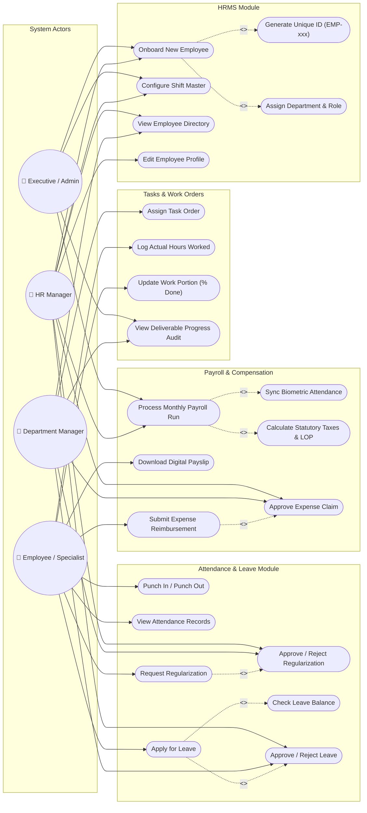

# HRMS Workflow & Use Case Diagram Specification

This document provides visual Mermaid diagrams illustrating the complete **HRMS (Human Resource Management System) Workflow** and the **Use Case Diagram Flow** for the ERP Suite platform.

---

## 1. HRMS End-to-End Workflow Diagram

This workflow diagram illustrates the complete employee lifecycle from recruitment and onboarding to daily attendance, task execution, leave approvals, monthly payroll processing, and offboarding.

```mermaid
flowchart TD
    %% Styling
    classDef startEnd fill:#1e293b,stroke:#0f172a,stroke-width:2px,color:#fff;
    classDef process fill:#f8fafc,stroke:#cbd5e1,stroke-width:2px,color:#0f172a;
    classDef decision fill:#eff6ff,stroke:#3b82f6,stroke-width:2px,color:#1e3a8a;
    classDef database fill:#f0fdf4,stroke:#22c55e,stroke-width:2px,color:#14532d;
    classDef approval fill:#fef3c7,stroke:#f59e0b,stroke-width:2px,color:#78350f;

    Start(["1. Recruitment & Candidate Sourcing"]):::startEnd --> CandidateEval["2. Interview & Candidate Evaluation"]:::process
    CandidateEval --> OfferAccepted{"Offer Accepted?"}:::decision

    OfferAccepted -- "No" --> Rejected["Candidate Archived / Talent Pool"]:::process
    OfferAccepted -- "Yes" --> Onboarding["3. Employee Onboarding & Profile Creation"]:::process

    subgraph Onboarding_Phase ["Onboarding & Setup"]
        Onboarding --> GenEmpCode["Generate Unique Employee ID (EMP-xxx)"]:::process
        GenEmpCode --> AssignDept["Assign Department, Designation & System Role"]:::process
        AssignDept --> AssignShift["Assign Work Shift (General, Morning, Night)"]:::process
        AssignShift --> DB_Emp[("Save to PostgreSQL 'employees' Table")]:::database
    end

    DB_Emp --> DailyOps["4. Daily Workforce Operations"]:::process

    subgraph Daily_Operations ["Daily Operations & Attendance Cycle"]
        DailyOps --> PunchIn["Employee Daily Punch-In (Biometric / Web ESS)"]:::process
        PunchIn --> LateCheck{"Punched after Grace Period (15 mins)?"}:::decision
        LateCheck -- "Yes" --> MarkLate["Mark 'Late' & Log Delay Minutes"]:::process
        LateCheck -- "No" --> MarkOnTime["Mark 'Present / On Time'"]:::process
        
        MarkLate --> PunchOut["Employee Punch-Out at Shift End"]:::process
        MarkOnTime --> PunchOut
        
        PunchOut --> CalcHours["Calculate Worked Hours, Early Exit & Overtime"]:::process
        CalcHours --> DB_Attendance[("Save to 'attendance_records' Table")]:::database
    end

    subgraph Task_Execution ["Task & Deliverable Management"]
        AssignDept --> TaskAssign["Manager Assigns Task Deliverables"]:::process
        TaskAssign --> DB_Tasks[("Insert in 'tasks' & 'task_activities'")]:::database
        DB_Tasks --> ESS_Alert["Real-time Alert in 'ess_notifications'"]:::process
        ESS_Alert --> WorkPortion["Employee Executes & Updates % Done"]:::process
        WorkPortion --> TaskComplete{"100% Finalized?"}:::decision
        TaskComplete -- "Yes" --> AuditReport["Consolidate in Task Reports View"]:::process
        TaskComplete -- "No" --> WorkPortion
    end

    subgraph Self_Service_Requests ["Leave & Regularization Workflows"]
        PunchOut -.-> Regularization{"Missed Punch / Delay?"}:::decision
        Regularization -- "Yes" --> SubmitReg["Submit Attendance Regularization Request"]:::process
        SubmitReg --> RegApproval{"Manager / HR Approval?"}:::approval
        RegApproval -- "Approved" --> UpdateAttendance["Update Record to 'Present'"]:::process
        RegApproval -- "Rejected" --> KeepAttendance["Keep Penalty / Absent Flag"]:::process
        UpdateAttendance --> DB_Attendance

        DailyOps -.-> LeaveApply["Employee Submits Leave Request"]:::process
        LeaveApply --> LeaveBalanceCheck{"Leave Balance Available?"}:::decision
        LeaveBalanceCheck -- "Yes" --> ManagerLeaveApproval{"Manager Approval?"}:::approval
        LeaveBalanceCheck -- "No" --> RejectLeave["Reject (Exceeds Balance)"]:::process
        ManagerLeaveApproval -- "Approved" --> DB_Leave[("Record Approved Leave in 'leave_requests'")]:::database
        ManagerLeaveApproval -- "Rejected" --> RejectLeave
    end

    subgraph Monthly_Payroll_Cycle ["Monthly Payroll Processing"]
        DB_Attendance --> MonthEnd["5. Month-End Payroll Consolidation"]:::process
        DB_Leave --> MonthEnd
        
        MonthEnd --> SyncAttendance["Sync Total Working Days, LOP & Overtime Hours"]:::process
        SyncAttendance --> CalcGross["Calculate Gross Salary, HRA, Allowances"]:::process
        CalcGross --> CalcDeductions["Apply Deductions (PF, ESI, Professional Tax, LOP)"]:::process
        CalcDeductions --> NetSalary["Compute Net Salary Payable"]:::process
        NetSalary --> HR_Review{"HR / Finance Approval?"}:::approval
        
        HR_Review -- "Approved" --> ExecutePayroll["Execute Payroll Run & Disburse Salary"]:::process
        ExecutePayroll --> DB_Payroll[("Write to 'payroll_runs' & 'salary_slips'")]:::database
        DB_Payroll --> PostGL[("Post Journal Vouchers to General Ledger")]:::database
        DB_Payroll --> GenSlip["Generate Digital Payslip PDF in ESS Portal"]:::process
    end

    GenSlip --> PerformanceReview["6. Performance Review & Milestone Audit"]:::process
    PerformanceReview --> ExitCheck{"Employee Resignation / Exit?"}:::decision
    ExitCheck -- "No" --> DailyOps
    ExitCheck -- "Yes" --> Offboarding["7. Separation, FNF Settlement & Status: EXITED"]:::process
    Offboarding --> End([End Process]):::startEnd
```

---

## 2. HRMS Use Case Diagram Flow

This diagram outlines the core actors in the system and their respective functional capabilities, including dependencies (`<<include>>`) and optional approval workflows (`<<extend>>`).

---

## 3. Actor-to-Capability Matrix

| Functional Capability | Employee | Department Manager | HR Manager | Executive / Admin |
| :--- | :---: | :---: | :---: | :---: |
| **Biometric Punch In / Out** | ✅ | ✅ | ✅ | ✅ |
| **Apply for Leave & Regularization** | ✅ | ✅ | ✅ | ✅ |
| **View Own Timesheets & Payslips** | ✅ | ✅ | ✅ | ✅ |
| **Execute Tasks & Log Work Hours** | ✅ | ✅ | ✅ | ✅ |
| **Submit Expense Claims** | ✅ | ✅ | ✅ | ✅ |
| **Assign Tasks to Subordinates** | ❌ | ✅ | ✅ | ✅ |
| **Approve Leaves & Regularizations** | ❌ | ✅ | ✅ | ✅ |
| **Approve Expense Claims** | ❌ | ✅ | ✅ | ✅ |
| **View Deliverable & Task Reports** | ❌ | ✅ | ✅ | ✅ |
| **Employee Onboarding & ID Generation** | ❌ | ❌ | ✅ | ✅ |
| **Shift Configuration & Master Rules** | ❌ | ❌ | ✅ | ✅ |
| **Monthly Payroll Run & Salary Slip Dispatch** | ❌ | ❌ | ✅ | ✅ |
| **System Settings & Auto-Numbering Engine** | ❌ | ❌ | ❌ | ✅ |

---

## 4. Key Sub-Workflows

### A. Task Assignment & Execution Sub-Workflow
1. Manager selects target employee (via code, ID, or name).
2. API validates and stores task in PostgreSQL `tasks` table with initial `progress_percent: 0%`.
3. Auto-generates audit entry in `task_activities` and creates employee notification in `ess_notifications`.
4. Employee accesses ESS portal, updates milestone progress checkpoints, and logs hours.
5. Task status transitions to `COMPLETED` when progress reaches 100%, updating live dashboard metrics.

### B. Attendance & Regularization Sub-Workflow
1. Biometric punch captures timestamp, location, and IP address.
2. System evaluates timestamp against assigned shift start time + 15-minute grace period.
3. If late or missing punch, employee submits a regularization request with reason.
4. Manager receives pending approval notification and reviews request.
5. Approved regularization updates attendance status to `PRESENT` and adjusts working hours accordingly.

### C. Monthly Payroll Run Sub-Workflow
1. System pulls approved attendance days, late penalties, unpaid leaves (LOP), and overtime hours.
2. Applies employee salary structure (Basic + HRA + Special Allowance - PF - ESI - Professional Tax).
3. HR Manager verifies payroll preview and triggers payout run.
4. Generates immutable records in `payroll_runs` and creates digital payslip PDF in employee portal.
