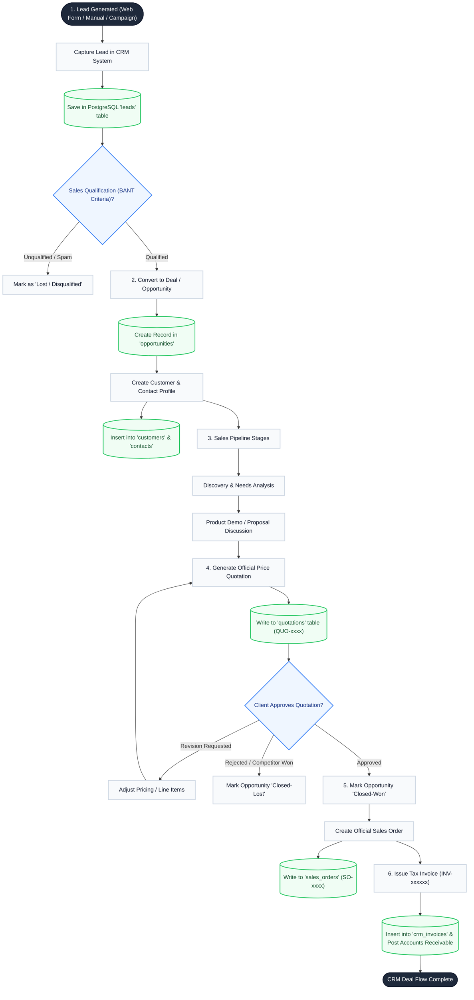
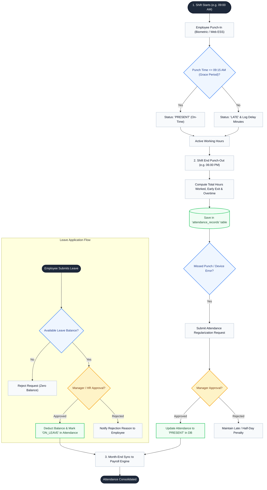
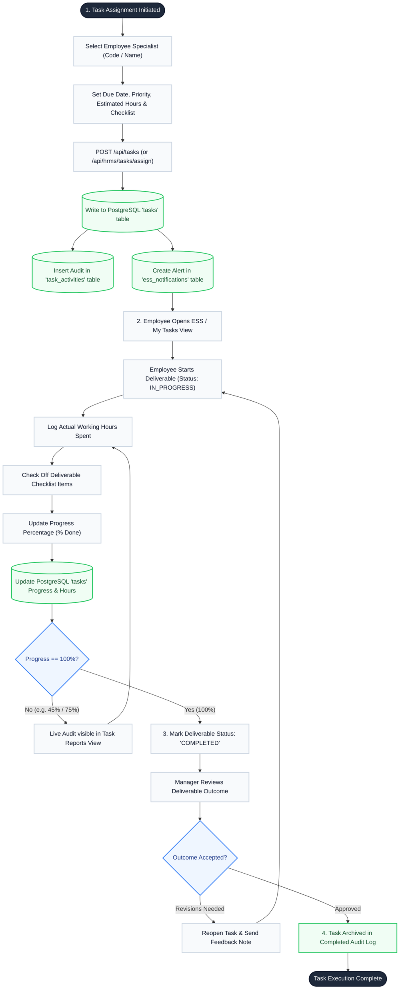
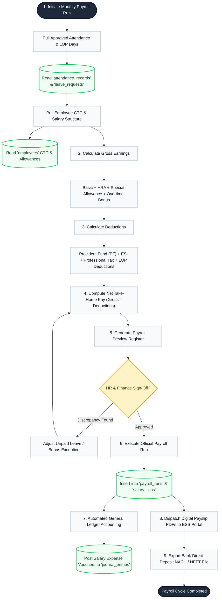
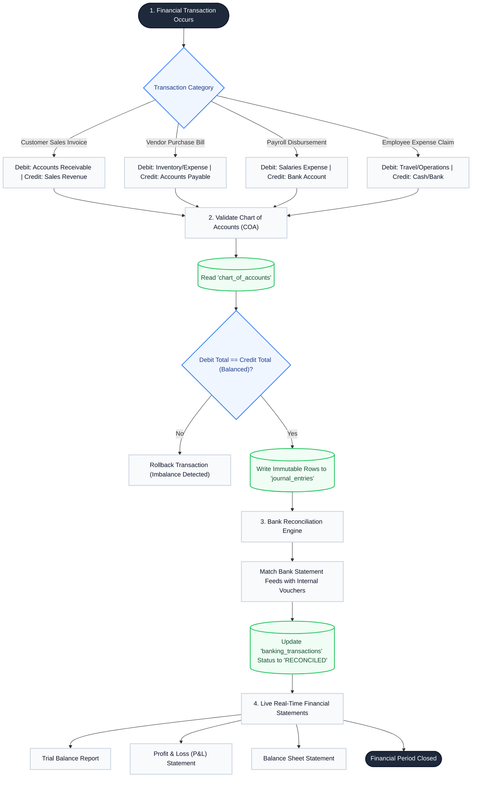
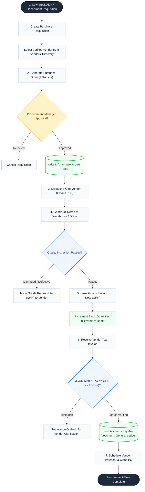
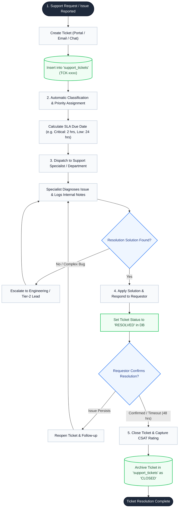
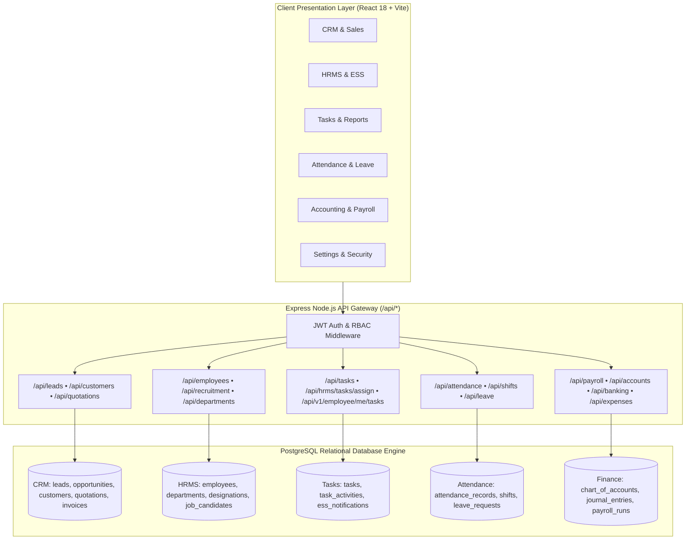

# ERP Suite: Module-by-Module End-to-End Workflow Diagrams

This guide contains complete, detailed workflow diagrams for each distinct enterprise module across the entire ERP/CRM/HRMS platform.

---

## 📑 Table of Modules
1. [CRM & Sales Pipeline Workflow](#1-crm--sales-pipeline-workflow)
2. [HRMS & Employee Lifecycle Workflow](#2-hrms--employee-lifecycle-workflow)
3. [Biometric Attendance & Leave Workflow](#3-biometric-attendance--leave-workflow)
4. [Task Intelligence & Work Deliverables Workflow](#4-task-intelligence--work-deliverables-workflow)
5. [Payroll Processing & Salary Disbursement Workflow](#5-payroll-processing--salary-disbursement-workflow)
6. [Double-Entry Accounting & Banking Workflow](#6-double-entry-accounting--banking-workflow)
7. [Procurement, Vendors & Inventory Workflow](#7-procurement-vendors--inventory-workflow)
8. [Support Helpdesk & Ticket Resolution Workflow](#8-support-helpdesk--ticket-resolution-workflow)

---

## 1. CRM & Sales Pipeline Workflow

Tracks leads from initial acquisition through opportunity deal stages, price quotation, sales order confirmation, and final invoice generation.

---

## 2. HRMS & Employee Lifecycle Workflow

Manages candidate hiring, onboarding, unique ID generation, department placement, performance audits, and eventual exit offboarding.

```mermaid
flowchart TD
    classDef startEnd fill:#1e293b,stroke:#0f172a,stroke-width:2px,color:#fff;
    classDef process fill:#f8fafc,stroke:#cbd5e1,stroke-width:2px,color:#0f172a;
    classDef decision fill:#eff6ff,stroke:#3b82f6,stroke-width:2px,color:#1e3a8a;
    classDef database fill:#f0fdf4,stroke:#22c55e,stroke-width:2px,color:#14532d;

    JobReq(["1. Job Requisition & Posting"]):::startEnd --> CandidateApply["Candidates Apply via Careers Portal"]:::process
    CandidateApply --> DB_Candidates[("Save in 'job_candidates' table")]:::database
    DB_Candidates --> ATS_Review["2. ATS Screening & Interview Scheduling"]:::process
    
    ATS_Review --> InterviewResult{"Interview Assessment Passed?"}:::decision
    InterviewResult -- "No" --> RejectCandidate["Send Polite Rejection / Talent Pool"]:::process
    InterviewResult -- "Yes" --> OfferLetter["3. Issue Digital Offer Letter"]:::process
    
    OfferLetter --> OfferAccept{"Candidate Accepts Offer?"}:::decision
    OfferAccept -- "Declined" --> ArchiveOffer["Archive Candidate Record"]:::process
    
    OfferAccept -- "Accepted" --> Onboarding["4. Employee Onboarding Workflow"]:::process
    Onboarding --> AutoEmpCode["Auto-Generate Employee Code (EMP-xxx)"]:::process
    AutoEmpCode --> SetOrgDetails["Assign Department, Designation & Reporting Manager"]:::process
    SetOrgDetails --> SetSalaryStructure["Configure CTC, Basic Salary & Allowances"]:::process
    SetSalaryStructure --> DB_Employees[("Write Active Record to 'employees' table")]:::database
    
    DB_Employees --> CreateESSUser["Provision ESS Portal Credentials"]:::process
    CreateESSUser --> ActiveWorkforce["5. Active Workforce Lifecycle"]:::process
    
    ActiveWorkforce --> AnnualReview["Performance Appraisals & Salary Increments"]:::process
    AnnualReview --> Resignation{"Resignation / Contract Termination?"}:::decision
    Resignation -- "No" --> ActiveWorkforce
    
    Resignation -- "Yes" --> Offboarding["6. Offboarding & Separation"]:::process
    Offboarding --> AssetHandover["Company Asset Handover & Knowledge Transfer"]:::process
    AssetHandover --> FNF_Settlement["Full & Final (FNF) Settlement Calculation"]:::process
    FNF_Settlement --> StatusExited["Update Status to 'EXITED' in DB"]:::database
    StatusExited --> EndHRMS(["HRMS Lifecycle Terminated"]):::startEnd
```

---

## 3. Biometric Attendance & Leave Workflow

Automates daily biometric punches, shifts, late penalties, leave balance deduction, and regularization approvals.

---

## 4. Task Intelligence & Work Deliverables Workflow

Manages task deliverable assignments, PostgreSQL persistence, live completion percentage auditing, and employee work portions.

---

## 5. Payroll Processing & Salary Disbursement Workflow

Synchronizes attendance records, calculates gross earnings, applies statutory taxes/deductions, produces payslips, and posts journal vouchers.

---

## 6. Double-Entry Accounting & Banking Workflow

Maintains balance sheets, profit & loss statements, customer invoicing receivables, vendor payable vouchers, and bank reconciliation.

---

## 7. Procurement, Vendors & Inventory Workflow

Handles purchase requisitions, vendor price quotes, Purchase Orders (PO), goods receipt stock updates, and vendor billing.

---

## 8. Support Helpdesk & Ticket Resolution Workflow

Handles customer and internal employee service tickets, SLA prioritization, technician dispatch, resolution, and satisfaction ratings.

---

## 9. Master Integration Architecture

