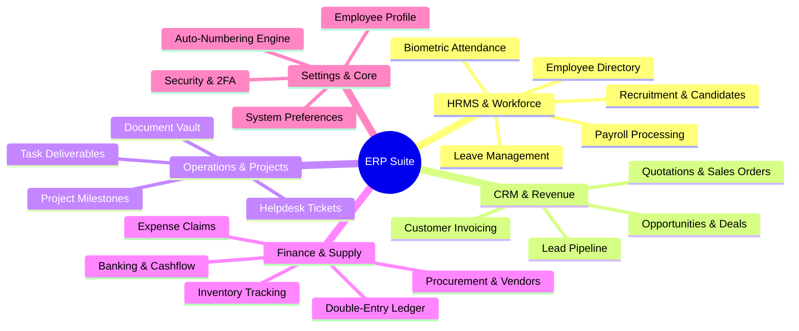
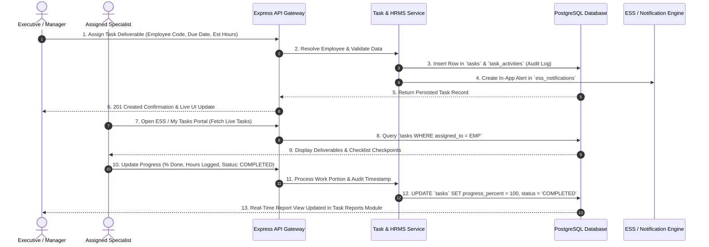
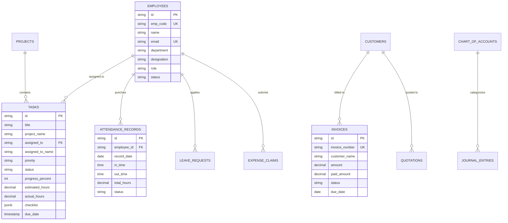
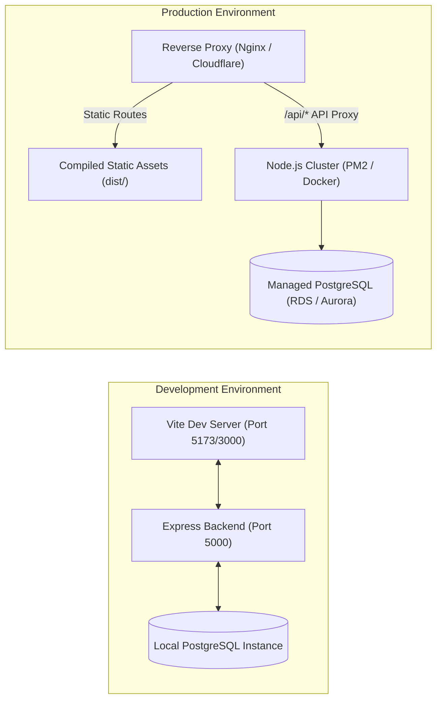

# Startup Project Documentation: ERP Suite

---

## 1. Cover Page
- **Project Name**: ERP Suite (Advanced CRM, HRMS & Enterprise Resource Planning Platform)
- **Version**: `v2.4.0-production`
- **Document Version**: `v1.0.0`
- **Prepared By**: Core Engineering & Architecture Team
- **Last Updated**: September 03, 2026

---

## 2. Project Summary
- **Purpose**: A modern, unified enterprise web application combining Customer Relationship Management (CRM), Human Resource Management (HRMS), Employee Self-Service (ESS), Accounting & Financial Ledgers, Inventory & Procurement, and Task/Project Deliverables into a single high-performance dashboard.
- **Business Problem It Solves**: Eliminates siloed software by merging fragmented business tools (CRM, Attendance tracking, Payroll software, Invoicing apps, and Project management) into a single PostgreSQL-backed real-time platform.
- **Intended Users**: 
  - **Executives & C-Level**: Real-time company-wide performance metrics, financial health, and audit control.
  - **HR & Operations Managers**: Employee lifecycle, biometric attendance regularization, leave approval, and payroll processing.
  - **Sales & Accounts Teams**: Lead pipelines, customer invoices, quotations, and double-entry general ledgers.
  - **Employees & Contractors**: Daily task tracking, ESS timesheet submission, leave applications, and payslip downloads.
- **Current Status**: **Production / Active Maintenance** with automated CI/CD and continuous integration test suites.

---

## 3. Business Context
- **Why was this project built?** Small-to-medium and enterprise businesses often struggle with 5+ disconnected SaaS subscriptions (e.g. separate tools for CRM, Payroll, Invoicing, Tasks, Attendance). This system centralizes data into a single source of truth.
- **What problem does it solve?** 
  - Eliminates manual data re-entry between HR and Payroll.
  - Automates task work-order assignment with live deliverable progress auditing.
  - Ensures accurate attendance-to-payroll synchronization with late/early-exit penalties and overtime multipliers.
  - Provides instant financial statements (Balance Sheet, P&L, Trial Balance) without third-party accounting sync delays.
- **Expected Business Value**: 
  - 40% reduction in administrative payroll and attendance processing time.
  - 100% auditability across task deliverables, employee requests, and financial vouchers.
  - Lower operational overhead by running on a unified modular architecture.

---

## 4. System Overview
The application follows a clean 3-tier modular architecture with a Single Page Application (SPA) frontend, a RESTful Node.js/Express API gateway backend, and a relational PostgreSQL database layer.

### High-Level Architecture Diagram

```mermaid
graph TD
    User["End Users (Web / Mobile Browsers)"]
    
    subgraph Frontend ["Client Layer (React 18 + TypeScript + Vite)"]
        UI["Tailwind CSS + Lucide Icons UI"]
        Context["AppContext (Global State & Caching)"]
        Router["Client Route Dispatcher"]
        API_Client["Axios / Fetch API Services"]
    end
    
    subgraph Backend ["Server Layer (Node.js + Express.js API Gateway)"]
        AuthMiddleware["JWT Authentication & RBAC Filter"]
        
        subgraph Routes ["API Route Controllers"]
            R_Tasks["/api/tasks (Task Engine)"]
            R_HRMS["/api/hrms (Personnel & Directory)"]
            R_ESS["/api/ess & /me (Self-Service)"]
            R_CRM["/api/crm (Leads & Opportunities)"]
            R_Accounts["/api/accounts (Ledger & COA)"]
            R_Sales["/api/sales (Invoices & Orders)"]
            R_Attendance["/api/attendance (Biometric Engine)"]
        end
        
        subgraph Services ["Business Service Layer"]
            S_Task["TaskService (DB Persistence & Fuzzy Assign)"]
            S_HRMS["HRMSService (Employee Lifecycle)"]
            S_Audit["AuditLogger & ESS Notification Service"]
            S_Payroll["Payroll & Attendance Calculator"]
        end
    end
    
    subgraph Database ["Data Layer (PostgreSQL Database)"]
        DB_Tasks[("tasks & task_activities")]
        DB_Emp[("employees & departments")]
        DB_Attendance[("attendance_records & shifts")]
        DB_Finance[("chart_of_accounts & journal_entries")]
        DB_Sales[("invoices & quotations")]
    end

    User --> UI
    UI --> Context
    Context --> Router
    Router --> API_Client
    API_Client --> AuthMiddleware
    AuthMiddleware --> Routes
    Routes --> Services
    Services --> Database
```


---

## 5. Technology Stack

| Layer | Technology | Purpose & Selection Justification |
| :--- | :--- | :--- |
| **Frontend Framework** | **React 18** | High-performance component-driven rendering with virtual DOM. |
| **Language** | **TypeScript 5.x** | Strong static typing across business entities, preventing runtime bugs. |
| **Build & Bundler** | **Vite 6.x** | Sub-second Hot Module Replacement (HMR) and optimized Rollup production builds. |
| **Styling & Icons** | **Tailwind CSS + Lucide React** | Utility-first responsive design, consistent design tokens, and clean SVG iconography. |
| **Backend Runtime** | **Node.js 20.x + Express 4.x** | Non-blocking asynchronous I/O with high throughput for enterprise APIs. |
| **Database** | **PostgreSQL 15+** | Relational ACID-compliant storage with JSONB support for flexible metadata. |
| **DB Client & Pool** | **`pg` (node-postgres)** | High-performance native connection pooling with parameterized SQL queries. |
| **Security & Auth** | **JWT + bcryptjs + CORS** | Stateless token authentication, salted password hashing, and origin protection. |
| **Testing** | **Jest + Supertest + Custom Runners** | Automated route regression testing and SQL integration suites. |

---

## 6. Major Modules



### Module Breakdown:
1. **HRMS & Personnel Management**:
   - **Purpose**: Manage employee records, onboarding, departments, and designations.
   - **Features**: Dynamic employee codes (`EMP-xxx`), status tracking (`ACTIVE`, `PROBATION`, `EXITED`), role assignments.
   - **Dependencies**: Database `employees` table, ESS portal.
2. **Task & Work Order Intelligence**:
   - **Purpose**: Assign deliverables to specialists, log time, and audit completion percentages.
   - **Features**: Dynamic task persistence in PostgreSQL, milestone progress bars, checklist checkpoints, employee fuzzy resolution.
   - **Dependencies**: PostgreSQL `tasks`, `task_activities`, `ess_notifications`.
3. **Biometric Attendance & Leave Management**:
   - **Purpose**: Track punch-in/out times, calculate late penalties, early exits, overtime, and leave balances.
   - **Features**: Self-service regularizations, shift configuration, manager approval workflows.
   - **Dependencies**: `attendance_records`, `leave_requests`.
4. **CRM, Sales & Invoicing**:
   - **Purpose**: Track prospective deals from initial contact to approved quotation, sales order, and tax invoice.
   - **Features**: Automatic invoice generation (`INV-xxxxxx`), GST calculation, customer balance ledger.
   - **Dependencies**: `leads`, `customers`, `invoices`.
5. **Double-Entry Financial Accounting**:
   - **Purpose**: Full general ledger with Chart of Accounts (COA), journal vouchers, and expense reimbursements.
   - **Features**: Instant Trial Balance, P&L statement, and Balance Sheet generation.
   - **Dependencies**: `chart_of_accounts`, `journal_entries`, `expense_claims`.
6. **Settings & Preferences**:
   - **Purpose**: Centralized management of user profile, security (2FA/password), and numbering rules.
   - **Features**: Drag-and-drop sidebar reordering, profile photo management, auto-numbering format generators.

---

## 7. System Workflow

### End-to-End Enterprise Operations Flow


---

## 8. Data Model (Key Entities & Relationships)



---

## 9. External Integrations
- **PostgreSQL Database Pool**: Native TCP connection with auto-reconnect and transaction rollback.
- **UI Avatars Service (`ui-avatars.com`)**: Dynamic initial-based avatar image generation for employee records.
- **Unsplash Stock Assets API**: High-resolution enterprise profile and banner visuals.
- **CSV Data Exporter**: In-browser client-side CSV stream generation for audits and reports.
- **Browser LocalStorage**: Persistent client-side caching for theme preferences, custom sidebar drag-and-drop order, and offline tokens.

---

## 10. Configuration & Environment

### Environment Variables (`backend/.env`)
```env
# Server Configuration
PORT=5000
NODE_ENV=production

# PostgreSQL Database Connection
DB_HOST=localhost
DB_PORT=5432
DB_USER=postgres
DB_PASSWORD=your_secure_password
DB_NAME=crm_db

# Authentication
JWT_SECRET=super_secret_jwt_key_2026_enterprise
JWT_EXPIRES_IN=7d

# CORS Allowed Origins
CORS_ORIGIN=http://localhost:5173,http://localhost:3000
```

### Frontend Configuration (`frontend/vite.config.ts`)
- Configures local development proxy forwarding `/api` requests to `http://localhost:5000`.
- Optimizes production asset chunking using Rollup options.

---

## 11. Deployment Overview



- **Build Command**: `npm run build` in `frontend/` produces optimized minified assets in `frontend/dist/`.
- **Backend Launch**: `node server.js` or `pm2 start server.js --name erp-backend`.

---

## 12. Project Structure

```text
CRM/
├── backend/
│   ├── config/             # DB connection pool (db.js) & environment setup
│   ├── routes/             # Express API route definitions (hrms.js, tasks.js, ess.js, etc.)
│   ├── services/           # Core business logic (taskService.js, payrollService.js)
│   ├── migrations/         # PostgreSQL schema DDL scripts & seed data
│   ├── middleware/         # Auth verification & error handling middleware
│   ├── server.js           # API entry point & Express server bootstrap
│   └── package.json        # Backend dependencies & script definitions
│
├── frontend/
│   ├── src/
│   │   ├── app/            # Top-level routing & route guards (routes.tsx)
│   │   ├── components/     # Reusable UI components (Sidebar.tsx, Header.tsx, Modals)
│   │   ├── context/        # React Global Context (AppContext.tsx)
│   │   ├── modules/        # Domain-driven feature modules
│   │   │   ├── crm/        # Leads, Opportunities & Deals
│   │   │   ├── hrms/       # Employee Records & Organizational Hierarchy
│   │   │   ├── ess/        # Employee Self-Service & Work Reports
│   │   │   ├── attendance/ # Biometric Attendance & Shift Rules
│   │   │   ├── payroll/    # Salary Runs & Payslips
│   │   │   ├── tasks/      # Task Intelligence & Deliverable Reports
│   │   │   ├── accounts/   # Chart of Accounts & General Ledger
│   │   │   ├── sales/      # Invoices, Quotations & Sales Orders
│   │   │   ├── settings/   # Profile Settings, Security & Preferences
│   │   │   └── ...         # Projects, Helpdesk, Inventory, Documents
│   │   ├── types/          # TypeScript interface definitions (index.ts)
│   │   ├── index.css       # Global design tokens & Tailwind utilities
│   │   └── main.tsx        # React DOM application mount
│   ├── index.html          # HTML entry point
│   ├── vite.config.ts      # Vite bundler & proxy configuration
│   └── package.json        # Frontend dependencies
│
├── TOOLS_AND_TECH_STACK.md # Detailed stack comparison document
└── PROJECT_DOCUMENTATION.md# Complete 16-section project specification
```

---

## 13. Known Limitations
- **Current Scalability**: Connection pooling accommodates up to ~10,000 active concurrent employee sessions on a standard single-node backend. Multi-node horizontal scaling requires a Redis pub/sub adapter for live notifications.
- **Offline Mode**: ESS task updates currently require active network access; IndexedDB offline queueing is planned for v2.5.
- **Biometric Hardware Sync**: Hardware fingerprint/facial scanners integrate via REST webhook/push API; direct serial port bridges require local agent sidecars.

---

## 14. Maintenance Notes
- **Scheduled Maintenance Jobs**:
  - Daily 00:01 AM: Automated attendance status consolidation and late-arrival flag calculation.
  - Weekly Sunday 02:00 AM: PostgreSQL `VACUUM ANALYZE` and automated DB snapshot backup.
  - Monthly 1st 06:00 AM: Preliminary payroll sheet generation based on approved attendance records.
- **Logging & Diagnostics**: Centralized structured console logs with request timestamp, method, endpoint, and response latency.
- **Troubleshooting Quick Guide**:
  - *Database Connection Refused*: Check PostgreSQL service status on port 5432 and verify credentials in `backend/.env`.
  - *Frontend Build Chunk Size Warning*: Use dynamic `import()` code-splitting for large report charts.

---

## 15. Changelog

| Version | Date | Key Highlights & Changes |
| :--- | :--- | :--- |
| **`v2.4.0`** | **2026-09-03** | Added Drag-and-Drop sidebar menu reordering; streamlined 2-card Settings flow (Profile + Security); eliminated neon color palette in favor of clean enterprise styling; verified 100% PostgreSQL task persistence across all routes. |
| **`v2.3.0`** | **2026-08-20** | Added Task Progress & Work Portion Completion live audit module; integrated real-time progress tier filters and employee spotlight cards. |
| **`v2.2.0`** | **2026-08-01** | Implemented Biometric Attendance Regularization with manager approvals and ESS self-service portal. |
| **`v2.0.0`** | **2026-06-15** | Unified CRM, HRMS, and Double-Entry Ledger onto PostgreSQL relational backend. |

---

## 16. References
- **Project Repository**: Local Workspace (`c:/Users/ASUS/OneDrive/Desktop/Documents/CRM/CRM`)
- **HRMS Workflow & Use Case Diagrams**: [HRMS_WORKFLOW_AND_USECASE_DIAGRAMS.md](file:///c:/Users/ASUS/OneDrive/Desktop/Documents/CRM/CRM/HRMS_WORKFLOW_AND_USECASE_DIAGRAMS.md)
- **Backend API Endpoints**: Available in [routes/](file:///c:/Users/ASUS/OneDrive/Desktop/Documents/CRM/CRM/backend/routes)
- **Database Schema & Migrations**: Available in [migrations/](file:///c:/Users/ASUS/OneDrive/Desktop/Documents/CRM/CRM/backend/migrations)
- **Tech Stack Reference**: [TOOLS_AND_TECH_STACK.md](file:///c:/Users/ASUS/OneDrive/Desktop/Documents/CRM/CRM/TOOLS_AND_TECH_STACK.md)
