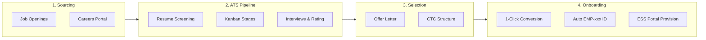
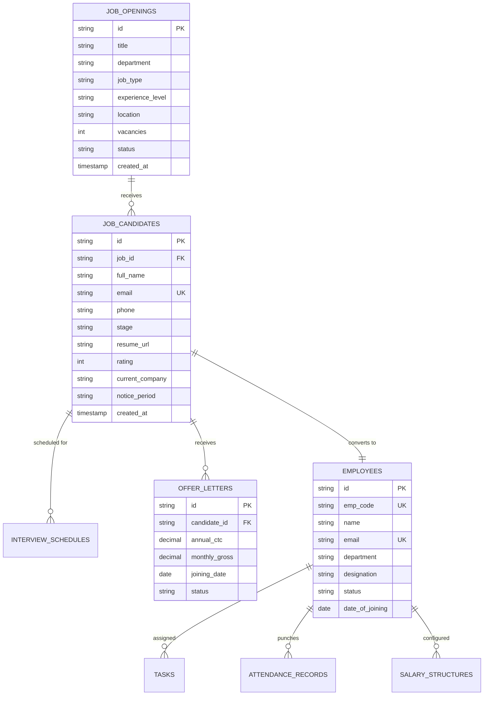

# Product Requirements Document (PRD): HRMS & Recruitment Module

---

## 📑 Document Metadata
- **Document Title**: Product Requirements Document (PRD) — HRMS & Talent Acquisition System
- **Project Name**: ERP Suite (HRMS Module)
- **Document Version**: `v1.0.0-final`
- **Target Release**: Production `v2.4.0`
- **Owner**: HRMS & Recruitment Core Product Engineering Team
- **Last Updated**: September 03, 2026

---

## 1. Executive Summary & Purpose

The **HRMS & Recruitment Module** provides an end-to-end Applicant Tracking System (ATS), recruitment management, candidate interview pipeline, digital offer letter issuance, and seamless **1-Click Employee Onboarding**.

### Core Objective:
To eliminate manual HR data re-entry by enabling a continuous data pipeline:
$$\text{Job Opening} \longrightarrow \text{Candidate Application} \longrightarrow \text{Interview \& Evaluation} \longrightarrow \text{Offer Letter} \longrightarrow \text{Active Employee Profile (EMP-xxx)}$$

---

## 2. User Personas & Stakeholder Matrix

| Persona | Role | Key Needs & Responsibilities |
| :--- | :--- | :--- |
| **Job Candidate** | External Applicant | Browse openings on Careers portal, submit resume/CV, track application status. |
| **Talent Recruiter** | HR Recruitment Lead | Create job openings, screen resumes, manage visual ATS Kanban stages, issue offer letters. |
| **Department Hiring Manager** | Technical / Dept Lead | Review candidate submissions, conduct interviews, submit feedback scorecards. |
| **HR Operations Manager** | HR Admin | Approve offer letters, execute 1-Click employee onboarding, allocate department/shifts. |
| **System Administrator** | IT Admin | Configure auto-numbering sequences, role permissions, and notification triggers. |

---

## 3. Scope & Key Feature Deliverables

---

## 4. Functional Requirements Specification (FRS)

### 4.1 Job Openings Management
- **FR-REC-101**: System shall allow HR to create, edit, duplicate, and archive job postings.
- **FR-REC-102**: Each job opening must capture:
  - Job Title (e.g. *Senior Full Stack Engineer*)
  - Department (e.g. *Development / Engineering*)
  - Employment Type (*Full-Time*, *Part-Time*, *Contract*, *Internship*)
  - Experience Required (*0-2 years*, *3-5 years*, *5+ years*)
  - Work Mode (*On-site*, *Remote*, *Hybrid*)
  - Number of Open Positions & Target Close Date
  - Status (*DRAFT*, *OPEN*, *ON_HOLD*, *CLOSED*)

### 4.2 Candidate Intake & Resume Management
- **FR-REC-201**: Public Careers portal integration allowing candidates to apply directly with resume attachment (PDF/DOCX).
- **FR-REC-202**: Manual candidate entry modal for referrals, agency candidates, and internal promotions.
- **FR-REC-203**: Automatic duplication check using Email and Phone Number to prevent redundant candidate entries.

### 4.3 Visual ATS Kanban Pipeline
- **FR-REC-301**: Interactive drag-and-drop Kanban board spanning standard recruitment stages:
  1. `APPLIED` (Initial Intake)
  2. `SCREENED` (Resume Verified)
  3. `INTERVIEW_ROUND_1` (Technical Assessment)
  4. `INTERVIEW_ROUND_2` (Managerial / Cultural Fit)
  5. `OFFERED` (Offer Letter Dispatched)
  6. `HIRED` (Offer Accepted)
  7. `REJECTED` (Disqualified / Talent Pool)
- **FR-REC-302**: Quick filters by Department, Job Title, Stage, and Recruiter Assignee.

### 4.4 Interview Scheduler & Evaluation Scorecards
- **FR-REC-401**: Schedule interviews with date, time, interview mode (Google Meet, Zoom, In-Person), and interviewers.
- **FR-REC-402**: Interviewer feedback scorecard capturing technical rating (1-5 stars), cultural fit rating, and hiring recommendation (*Strong Yes*, *Yes*, *Neutral*, *No*).

### 4.5 Digital Offer Letter Management
- **FR-REC-501**: Configurable offer letter template generation with dynamic placeholder merging:
  - Candidate Full Name, Job Designation, Department
  - Annual CTC, Monthly Gross Salary, Basic Pay, HRA, Allowances
  - Joining Date, Probation Period (months), Offer Expiry Date
- **FR-REC-502**: Offer status tracking (*DRAFT*, *SENT*, *ACCEPTED*, *DECLINED*, *EXPIRED*).

### 4.6 1-Click Candidate-to-Employee Conversion Engine
- **FR-REC-601**: Upon marking candidate status as `HIRED`, an actionable **"Convert to Employee"** modal appears.
- **FR-REC-602**: The conversion engine automatically:
  1. Generates the next sequential unique Employee ID (e.g. `EMP-001`, `EMP-002`).
  2. Creates an active profile in PostgreSQL `employees` table.
  3. Initializes the employee's salary structure in `salary_structures`.
  4. Sets the employee status to `ACTIVE`.
  5. Provisions default ESS (Employee Self-Service) portal credentials.
  6. Sends a welcome notification and creates an initial audit log entry.

---

## 5. Data Model & Database Schema

---

## 6. REST API Endpoints Specification

| Method | Endpoint | Description | Request Body Payload |
| :--- | :--- | :--- | :--- |
| `GET` | `/api/recruitment/jobs` | Fetch all job openings with applicant counts. | N/A |
| `POST` | `/api/recruitment/jobs` | Create a new job opening requisition. | `{ title, department, jobType, vacancies, description }` |
| `GET` | `/api/recruitment/candidates` | Fetch candidates list with stage filters. | Query params: `?jobId=&stage=` |
| `POST` | `/api/recruitment/candidates` | Register/submit a new candidate application. | `{ jobId, fullName, email, phone, resumeFile }` |
| `PUT` | `/api/recruitment/candidates/:id/stage` | Move candidate to a new ATS Kanban stage. | `{ stage: "OFFERED" }` |
| `POST` | `/api/recruitment/interviews` | Schedule an interview round with scorecards. | `{ candidateId, interviewerId, scheduledAt, meetingLink }` |
| `POST` | `/api/recruitment/offers` | Issue a digital offer letter. | `{ candidateId, annualCtc, joiningDate, allowances }` |
| `POST` | `/api/recruitment/convert-to-employee` | **1-Click Employee Onboarding Engine**. | `{ candidateId, department, designation, salaryStructure }` |

---

## 7. Non-Functional Requirements (NFR)

1. **Performance**:
   - ATS Kanban board load latency $< 250\text{ ms}$ for datasets up to 10,000 active candidates.
   - 1-Click candidate-to-employee conversion execution time $< 500\text{ ms}$.
2. **Security & Data Privacy**:
   - Candidate resumes and contact details stored with restricted Role-Based Access Control (RBAC).
   - Passwords and auth tokens secured via bcrypt salted hashes and signed JWTs.
3. **Auditability & Compliance**:
   - Every candidate stage transition and offer salary modification logged in `activity_logs`.

---

## 8. Acceptance Criteria & Success Metrics

- [x] **Zero Data Loss**: Candidate data seamlessly transitions into the `employees` table upon hiring.
- [x] **Unique Auto-Numbering**: Employee codes generate strictly sequential IDs (`EMP-001`, `EMP-002`) with zero collisions.
- [x] **Downstream Synchronization**: Converting a candidate immediately makes them visible in **Employee Directory**, **Biometric Attendance**, **Task Work Orders**, and **Payroll Engine**.
- [x] **100% Test Pass Rate**: Verified through automated API regression test suite `test_recruitment_careers_integration.js`.
