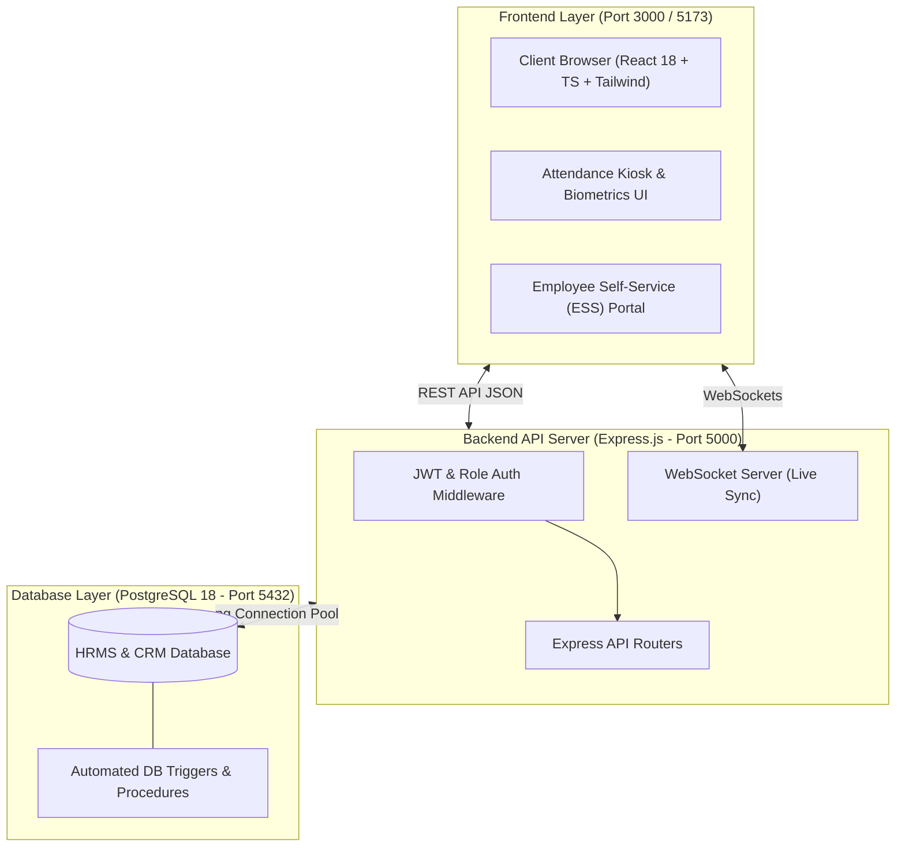

# 🌐 Enterprise CRM, HRMS & ERP Management Platform

[](https://reactjs.org/)
[](https://www.typescriptlang.org/)
[](https://vitejs.dev/)
[](https://tailwindcss.com/)
[](https://nodejs.org/)
[](https://expressjs.com/)
[](https://www.postgresql.org/)
[](https://developer.mozilla.org/en-US/docs/Web/API/WebSockets_API)
[](https://www.docker.com/)

An all-in-one, enterprise-grade **Customer Relationship Management (CRM)**, **Human Resource Management System (HRMS)**, **Employee Self-Service (ESS) Portal**, and **Finance/ERP System**. Built on a high-performance **Database-First PostgreSQL Architecture**, with a responsive React/TypeScript frontend, Express backend, and real-time WebSockets synchronization.

---

## 📑 Table of Contents

- [Overview & Architecture](#-overview--architecture)
- [System Features by Module](#-system-features-by-module)
  - [1. HRMS (Human Resources)](#1-hrms-human-resources)
  - [2. Employee Self-Service (ESS)](#2-employee-self-service-ess)
  - [3. CRM (Customer Relationship Management)](#3-crm-customer-relationship-management)
  - [4. Finance, Accounting & ERP](#4-finance-accounting--erp)
  - [5. Enterprise Task & Performance Engine](#5-enterprise-task--performance-engine)
- [Project Architecture & Tech Stack](#-project-architecture--tech-stack)
- [Directory Structure](#-directory-structure)
- [Quick Start Guide](#-quick-start-guide)
  - [Prerequisites](#prerequisites)
  - [Option A: Local Development Setup](#option-a-local-development-setup)
  - [Option B: Docker Compose Setup](#option-b-docker-compose-setup)
- [Database Schema & Migrations](#-database-schema--migrations)
- [REST API Endpoints Reference](#-rest-api-endpoints-reference)
- [Role-Based Access Control (RBAC) & Test Accounts](#-role-based-access-control-rbac--test-accounts)
- [Automated Test Suites](#-automated-test-suites)
- [Production Deployment](#-production-deployment)
- [License & Support](#-license--support)

---

## 🏛 Overview & Architecture



---

## 🌟 System Features by Module

### 1. HRMS (Human Resources)
- **Employee 360° Management**: Complete directory, profiles, department assignments, designations, branch allocation, statutory documents, and bank details.
- **Biometric / Virtual Attendance Kiosk**: Daily clock-in/out, GPS/Device coordinates, break tracking, shift validation, overtime calculation, and late check-in detection.
- **Roster & Shift Scheduling**: Rotational shift configurations, grace periods, off-day schedules, and automated shift-allowance processing.
- **Intelligent Leave Management**: 
  - Dynamic leave balances (Casual, Sick, Earned, Loss of Pay - LOP).
  - Multi-tier approval workflows (Manager & HR Admin approval stages).
  - Admin/Manager comments, leave cancellation sync, and calendar overview.
- **Central Payroll Engine**:
  - Configurable CTC structures (Basic, HRA, Conveyance, Special Allowances).
  - Automated statutory deductions: Provident Fund (PF), ESI, TDS (Income Tax), and Professional Tax.
  - Automated Loss of Pay (LOP) deductions computed directly from attendance and leave records.
  - Automated salary register generation, payment disbursement ledger, and Payslip PDF downloads.
- **Recruitment & Applicant Tracking System (ATS)**:
  - Job vacancies creation with customizable stages.
  - Public Careers page for candidate applications.
  - Candidate pipeline (Screening, Technical Interview, HR Round, Offer, Onboarding).

### 2. Employee Self-Service (ESS)
- **Dedicated Employee Portal (`/employee`)**: Lightweight, employee-centric dashboard isolated from admin controls.
- **One-Click Real-time Clock In/Out**: Live timer and daily status tracker.
- **Leave Request & Balances**: Apply for leave, view status in real-time, view remaining balances, and cancel pending requests.
- **Payslips & Financials**: View monthly payslips, detailed earnings/deductions breakdown, and one-click PDF generation.
- **Personal Tasks & Workflows**: Check assigned tasks, change task statuses (Pending, In Progress, Completed), submit attachments, and complete subtask checklists.
- **Company Announcements & Directory**: Organization notices, public holidays, and department contacts.

### 3. CRM (Customer Relationship Management)
- **Lead & Opportunity Pipeline**: Visual Kanban board for leads with scoring, source attribution, and conversion stages.
- **Customer Directory**: Complete customer profiles, interaction timeline, communication history, and custom tags.
- **Sales Deals & Quotations**: Deal stages, expected closing dates, value forecasts, quotation generation, and invoicing triggers.
- **Helpdesk & Support Ticketing**: SLA tracking, priority levels (Low, Medium, High, Urgent), ticket assignment, and customer satisfaction metrics.

### 4. Finance, Accounting & ERP
- **Chart of Accounts & General Ledger**: Double-entry accounting system with automated debit/credit balancing.
- **Banking & Cash Management**: Multiple bank accounts, transaction tracking, reconciliation logs, and cash flow visualization.
- **Expense Claims & Reimbursement**: Expense category allocation, receipt upload, manager approval, and direct settlement via payroll or accounts.
- **Sales Invoicing & Purchase Orders**: Automated invoice generation from sales deals, vendor POs, and payment tracking.
- **Inventory & Stock Management**: Item catalogs, real-time quantity tracking, reorder alerts, and valuation.

### 5. Enterprise Task & Performance Engine
- **Task Delegation**: Assign tasks across departments with priority ratings (Urgent, High, Normal, Low) and target deadlines.
- **Subtask Checklists & Progress**: Granular checklists with automated completion percentage computation.
- **File Attachments & Documents**: Upload deliverables, project documents, and review files with static asset delivery.
- **Real-Time Synchronized Workflows**: Live updates across managers and employees using WebSocket notifications.

---

## 🛠 Project Architecture & Tech Stack

| Layer | Technology | Description |
| :--- | :--- | :--- |
| **Frontend UI** | React 18 (`react`, `react-dom`) | Single Page Application with Component Architecture |
| **Language** | TypeScript 5.7 / JavaScript ESM | Strict type-safety, interface modeling, and maintainability |
| **Styling** | Tailwind CSS 3.4 + PostCSS | Sleek, modern utility-first CSS with dark/light themes |
| **Icons** | Lucide React | Modern, crisp icon system |
| **Build Tool** | Vite 6.1 | Superfast HMR development server and optimized bundler |
| **Backend API** | Node.js + Express 4.21 (ESM) | High throughput REST API and middleware pipeline |
| **Database** | PostgreSQL 18 (Alpine) | Relational SQL storage with triggers, views, and constraints |
| **DB Driver** | `pg` (node-postgres Connection Pool) | Optimized SQL queries and connection pooling |
| **Real-time** | WebSockets (`ws`) | Instant bidirectional notifications and state synchronization |
| **Security** | `jsonwebtoken`, `bcryptjs`, `cors` | JWT token authentication, password hashing, CORS protection |
| **Validation** | `zod` | Robust runtime request and data validation |
| **Container** | Docker & Docker Compose | Containerized multi-service deployment |

---

## 📁 Directory Structure

```text
CRM/
├── docker-compose.yml              # Multi-container orchestration (DB, API, Frontend)
├── backend/                        # Node.js + Express API Server
│   ├── config/                     # Configuration files & DB connection settings
│   ├── db/
│   │   ├── pool.js                 # PostgreSQL connection pool manager
│   │   └── migrations/             # Sequential SQL migration files
│   │       ├── 001_initial_schema.sql
│   │       ├── 002_enterprise_complete_schema.sql
│   │       ├── 003_automatic_database_triggers.sql
│   │       ├── 004_db_first_complete.sql
│   │       ├── 005_master_prompt_complete_schema.sql
│   │       ├── 006_central_payroll_engine.sql
│   │       ├── 007_ess_portal_engine.sql
│   │       ├── 008_ess_admin_two_way_integration.sql
│   │       ├── 009_admin_notifications_and_two_way_sync.sql
│   │       ├── 010_enterprise_task_management_and_performance.sql
│   │       └── 011_task_attachments.sql
│   ├── middleware/                 # Auth verification, RBAC, error handlers
│   ├── routes/                     # REST API Route endpoints
│   │   ├── auth.js                 # Authentication & login routes
│   │   ├── employees.js            # Employee directory & HR profile routes
│   │   ├── attendance.js           # Kiosk & Daily attendance routes
│   │   ├── shifts.js               # Shifts & scheduling routes
│   │   ├── leave.js                # Leave balance, requests & approvals
│   │   ├── payroll.js              # Payroll generation, CTC & payslips
│   │   ├── tasks.js                # Enterprise task management & attachments
│   │   ├── ess.js                  # Employee self-service API endpoints
│   │   ├── recruitment.js          # ATS, Careers & job candidates
│   │   ├── accounts.js             # General ledger & chart of accounts
│   │   ├── banking.js              # Banking & transactions
│   │   ├── expenses.js             # Expenses & reimbursements
│   │   ├── departments.js          # Departments & organizational units
│   │   ├── designations.js         # Designations & job titles
│   │   ├── branches.js             # Branch locations
│   │   └── dashboard.js            # Executive dashboard analytics & metrics
│   ├── services/                   # Business logic & domain services
│   ├── utils/                      # WebSocket helper, logger & utilities
│   ├── setup_hrms.js               # Database bootstrap & auto-migration script
│   ├── index.js                    # Express application entrypoint
│   └── package.json                # Backend dependencies & scripts
│
└── frontend/                       # React 18 + TypeScript + Vite SPA
    ├── src/
    │   ├── app/                    # Main application wrapper & providers
    │   ├── components/             # Reusable UI components, header, sidebar
    │   │   ├── auth/               # Login, Register, Landing & Careers pages
    │   │   ├── dashboard/          # Dynamic Role-based Dashboards
    │   │   └── layout/             # Header, Navigation Sidebar, Modals
    │   ├── context/                # React Context (Auth, AppState, Notification)
    │   ├── modules/                # Domain-specific UI Modules
    │   │   ├── hrms/               # HRMS Directory & Employee profiles
    │   │   ├── ess/                # Employee Self-Service (ESS) pages & views
    │   │   ├── attendance/         # Attendance Kiosk, logs & timesheets
    │   │   ├── leave/              # Leave tracker, approvals & calendar
    │   │   ├── payroll/            # Payroll register, CTC calculator & payslip
    │   │   ├── tasks/              # Task management board & checklists
    │   │   ├── crm/                # CRM pipeline, leads & customer views
    │   │   ├── sales/              # Orders, quotations & deals
    │   │   ├── accounts/           # Accounts & ledger views
    │   │   ├── banking/            # Bank accounts & reconciliations
    │   │   ├── expenses/           # Expense tracking & reimbursements
    │   │   ├── recruitment/        # Job postings & candidate ATS board
    │   │   ├── inventory/          # Inventory & stock monitoring
    │   │   ├── helpdesk/           # Support tickets & SLA dashboard
    │   │   └── settings/           # System settings & preferences
    │   ├── services/               # API clients & backend communication
    │   ├── styles/                 # Global styles & Tailwind CSS directives
    │   └── types/                  # TypeScript interfaces & type definitions
    ├── vite.config.ts              # Vite configuration
    └── package.json                # Frontend dependencies & scripts
```

---

## 🚀 Quick Start Guide

### Prerequisites
Make sure you have installed:
- **Node.js**: v18.0.0 or higher ([Download Node.js](https://nodejs.org/))
- **PostgreSQL**: v14.0 or higher ([Download PostgreSQL](https://www.postgresql.org/download/)) or Docker Desktop
- **Git**

---

### Option A: Local Development Setup

#### 1. Configure PostgreSQL Database
Start PostgreSQL server on your machine and create the database (or let `setup_hrms.js` create it automatically):
```sql
CREATE DATABASE "HRMS";
```

#### 2. Configure Backend Server
Navigate to the `backend` folder:
```bash
cd backend
```

Create `.env` file (or copy `.env.example`):
```env
PORT=5000
NODE_ENV=development
DB_USER=postgres
DB_PASSWORD=postgres
DB_HOST=localhost
DB_NAME=HRMS
DB_PORT=5432
JWT_SECRET=enterprise_super_secret_jwt_key_2026
```

Install backend dependencies and run database initialization:
```bash
npm install
node setup_hrms.js
```

Start the backend API server:
```bash
npm start
# or for auto-reload on file changes:
npm run dev
```
> Backend API will be active at: `http://localhost:5000` (Health Check: `http://localhost:5000/api/health`)

#### 3. Configure Frontend Application
Open a new terminal and navigate to the `frontend` folder:
```bash
cd frontend
npm install
```

Start the Vite development server:
```bash
npm run dev
```
> The application will be running at: `http://localhost:5173` or `http://localhost:3000`

---

### Option B: Docker Compose Setup

Run the entire stack (PostgreSQL + Backend + Frontend) in one command:

```bash
docker-compose up --build
```

- **Frontend**: `http://localhost:3000`
- **Backend API**: `http://localhost:5000`
- **PostgreSQL Database**: `localhost:5432` (`HRMS` database)

---

## 🗄 Database Schema & Migrations

The database is built with a strictly structured, fully normalized relational schema located in `backend/db/migrations/`:

| Migration File | Key Features & Tables |
| :--- | :--- |
| `001_initial_schema.sql` | Base users, roles, basic company configurations. |
| `002_enterprise_complete_schema.sql` | Core HRMS tables: `employees`, `departments`, `designations`, `branches`, `shifts`, `attendance_logs`. |
| `003_automatic_database_triggers.sql` | PostgreSQL triggers for auto-updating timestamps, calculating daily attendance durations, and late penalties. |
| `004_db_first_complete.sql` | Accounts, general ledger, customers, leads, products, sales orders, purchase invoices, and expense claims. |
| `005_master_prompt_complete_schema.sql` | Enhanced data models, candidate job applications, helpdesk tickets, and audit logging. |
| `006_central_payroll_engine.sql` | `employee_salaries`, `payroll_runs`, `payslips`, `salary_components`, statutory deductions (PF/ESI/TDS/PT), and LOP auto-deductions. |
| `007_ess_portal_engine.sql` | Employee Self-Service credentials, PIN hashes, biometric sync, and personal notification tokens. |
| `008_ess_admin_two_way_integration.sql` | Real-time two-way synchronization between ESS portal actions and Admin dashboard approvals. |
| `009_admin_notifications_and_two_way_sync.sql` | Admin alert queue, leave status sync triggers, and payroll change listeners. |
| `010_enterprise_task_management_and_performance.sql` | Enterprise tasks, milestones, assignees, priorities, subtask checklist items, and KPI metrics. |
| `011_task_attachments.sql` | Multi-file attachment storage metadata, MIME validation, and file URLs. |

---

## 📡 REST API Endpoints Reference

### 🔐 Authentication & Session
- `POST /api/auth/login` - Authenticate employee/admin with Email or Employee Code + Password/PIN.
- `GET /api/auth/session` - Validate existing JWT session token.

### 👥 HRMS & Employee Directory
- `GET /api/employees` - Retrieve list of all employees (with filters for department, status, role).
- `POST /api/employees` - Register a new employee with CTC, statutory info, and job role.
- `GET /api/employees/:id` - Fetch full 360° employee profile.
- `PUT /api/employees/:id` - Update employee details, salary structure, and status.
- `DELETE /api/employees/:id` - Deactivate or remove employee record.

### ⏰ Attendance & Shifts
- `POST /api/attendance/clock-in` - Record employee clock-in with timestamp & device info.
- `POST /api/attendance/clock-out` - Record employee clock-out and calculate total hours.
- `GET /api/attendance/daily` - Get real-time daily attendance roster.
- `GET /api/attendance/history/:employeeId` - Retrieve monthly attendance history.
- `GET /api/shifts` - Fetch all work shifts and rotational schedules.

### 🏖 Leave Management
- `GET /api/leave/balances/:employeeId` - Get remaining leave quotas (Casual, Sick, Earned).
- `POST /api/leave/apply` - Submit a new leave application.
- `GET /api/leave/requests` - Fetch all leave requests (Admin/Manager view).
- `PUT /api/leave/requests/:id/status` - Approve, Reject, or modify leave request status.
- `DELETE /api/leave/requests/:id` - Cancel pending leave request.

### 💰 Central Payroll Engine
- `GET /api/payroll/structures` - Fetch salary & CTC structures across employees.
- `POST /api/payroll/run` - Execute monthly payroll run with automated LOP deduction computation.
- `GET /api/payroll/runs` - List past payroll disbursement batches.
- `GET /api/payroll/payslip/:employeeId/:month` - Generate and view detailed payslip.

### 📋 Enterprise Tasks
- `GET /api/tasks` - Fetch tasks (filtered by assignee, priority, status, department).
- `POST /api/tasks` - Create a new enterprise task with subtasks and deadline.
- `PUT /api/tasks/:id` - Update task progress, checklist items, and status.
- `POST /api/tasks/:id/attachments` - Upload project deliverables and task files.

### 📱 Employee Self-Service (ESS)
- `GET /api/v1/employee/profile` - Fetch logged-in employee profile.
- `GET /api/v1/employee/attendance` - Fetch self attendance logs and metrics.
- `GET /api/v1/employee/leaves` - Fetch self leave history and current quota.
- `GET /api/v1/employee/payslips` - View and download employee salary payslips.
- `GET /api/v1/employee/tasks` - Fetch personal assigned tasks & update status.

---

## 🔑 Role-Based Access Control (RBAC) & Test Accounts

The platform comes with predefined role personas for testing all features seamlessly:

| Role | Default Email / Username | Default Password | Access Level & Permissions |
| :--- | :--- | :--- | :--- |
| **Executive / Super Admin** | `sarah.jenkins@company.com` | `123456` | Complete access to CRM, HRMS, Finance, ERP & System Settings |
| **HR Admin** | `priya.sharma@company.com` | `123456` | Employee Directory, Attendance, Leave Approvals, Payroll, Recruitment |
| **Finance Accountant** | `finance@company.com` | `123456` | General Ledger, Banking, Expense Reimbursements, Invoices & Payroll |
| **Sales Director** | `michael.vance@company.com` | `123456` | CRM Leads, Customers, Deals, Quotations, Sales Orders |
| **Lead Architect / Manager** | `vishnu.vardhan@company.com` | `123456` | Team Task Assignment, Performance KPIs, Leave Approval |
| **Employee (ESS)** | `ashok@company.com` / `EMP-006` | `123456` | Dedicated Employee Self-Service (`/employee`), Clock In/Out, Leaves, Payslips, Tasks |

---

## 🧪 Automated Test Suites

The backend includes a comprehensive suite of end-to-end (E2E) and integration tests:

```bash
cd backend

# Test Central Payroll & LOP Engine
node test_payroll_production_suite.js

# Test Task Management & Attachments E2E
node test_task_management_e2e.js

# Test ESS and Admin Two-Way Sync
node test_ess_admin_complete_suite.js

# Test Leave Approval & Cancellation Workflow
node test_leave_approval_workflow.js

# Test Recruitment & Careers Integration
node test_recruitment_careers_integration.js

# Test Salary Payment & Ledger E2E
node test_salary_payment_e2e.js
```

---

## 📦 Production Deployment

### 1. Build Frontend Bundle
```bash
cd frontend
npm run build
```
This generates an optimized, production-ready static bundle in `frontend/dist/`.

### 2. Run with PM2 or Production Node
```bash
cd backend
NODE_ENV=production node index.js
```

### 3. Nginx Reverse Proxy Configuration (Sample)
```nginx
server {
    listen 80;
    server_name erp.yourdomain.com;

    # Serve React Frontend Static Files
    location / {
        root /var/www/crm/frontend/dist;
        try_files $uri $uri/ /index.html;
    }

    # Proxy REST API Requests to Node.js Backend
    location /api/ {
        proxy_pass http://localhost:5000/api/;
        proxy_http_version 1.1;
        proxy_set_header Upgrade $http_upgrade;
        proxy_set_header Connection 'upgrade';
        proxy_set_header Host $host;
        proxy_cache_bypass $http_upgrade;
    }

    # Proxy WebSocket Traffic
    location /ws {
        proxy_pass http://localhost:5000;
        proxy_http_version 1.1;
        proxy_set_header Upgrade $http_upgrade;
        proxy_set_header Connection "Upgrade";
        proxy_set_header Host $host;
    }
}
```

---

## 📄 License & Support

This project is licensed under the **MIT License**.

Developed for enterprise business management, workforce orchestration, and scalable operations. For issues, enhancements, or custom integrations, open a ticket or reach out to the development team.
